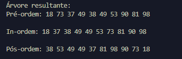

## Binary Tree & AVL Tree

Olá! Meu nome é Thales. E fiz esse código com o intuito de promover meu conhecimento em java.

## Instruções de Uso

Para utilizar esse código, apenas intale o respositório e rode o programa!

## Como o código funciona

A interface vai te perguntar qual tipo de árvore gostaria de utilizar,
Após escolher a opção, caso insira manualmente os nodes na árvore, após 
o balanceamento o código irá printar, a pré-ordem, in-ordem, e pós-ordem,
da árvore inserida

## Contribuições

Contribuições são bem-vindas! Aceito qualquer comentário de melhoria, ou correção de bugs!

## Licença

Caso queira utilizar esse programa para alguma coisa, o senhor(a) tem total liberdade

## Agradecientos

Agradeço por chegar até aqui! :D

